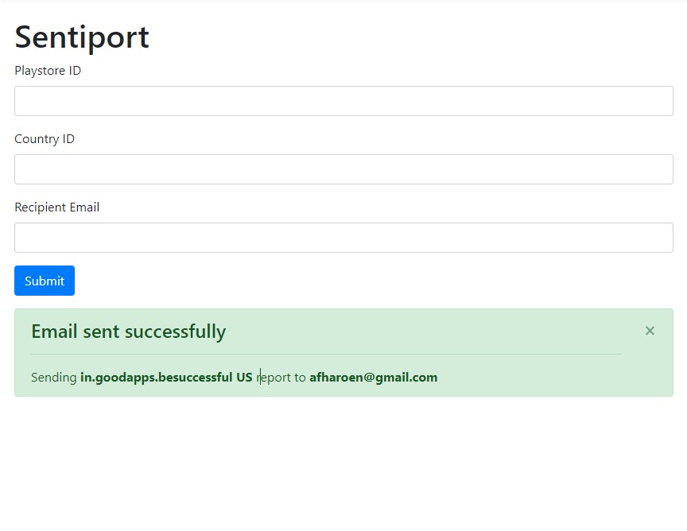

# **sentiport**
Super-minimalistic app version of the Data Analysts' sentiment analysis automated reporting 

## **Preview**


## **1. Project structure**
```
Root
│   .env
│   .gitignore
│   app.py
│   config.py
│   docker-compose.yml
│   Dockerfile
│   nltk.txt
│   Procfile
│   README.md
│   requirements.txt
│
├───screenshots
│       sentiport-preview.jpg
│
└───sentiport
    │   forms.py
    │   mail.py
    │   pdf_generator.py
    │   routes.py
    │   __init__.py
    │
    ├───artifacts
    │       artifacts.md
    │
    ├───static
    │       status.js
    │
    ├───templates
    │       404.html
    │       index.html
    │       mail.html
    │       root.html
    │       status.html
    │       success.html
    │
    └───utils
        ├───assets
        │       Closing Page.png
        │       closing_page.png
        │       cover_template.png
        │       Draft Tamplate & Sizing.pdf
        │       executive_summary.png
        │       Extreme Review.png
        │       Get other features template.png
        │       get_other_features.png
        │       Introduction.png
        │       Negative Review.png
        │       Overall Rating Analysis.png
        │       Overall Review Analysis.png
        │       Plain Page Template.png
        │       positive_review.png
        │       review_analysis_by_time.png
        │       review_analysis_by_version.png
        │       review_language_analysis.png
        │       sentiment_analysis.png
        │       table_of_content.png
        │       template_negative_reviews.png
        │
        ├───Helvetica-Font
        │       Helvetica-Bold.ttf
        │       Helvetica-BoldOblique.ttf
        │       helvetica-compressed-5871d14b6903a.otf
        │       helvetica-light-587ebe5a59211.ttf
        │       Helvetica-Oblique.ttf
        │       helvetica-rounded-bold-5871d05ead8de.otf
        │       Helvetica.ttf
        │
        ├───pdf_table_reportlab
        │       bad_good_review.py
        │
        ├───plot_detect_language
        │       detect_language.py
        │
        ├───plot_rating
        │       rating.py
        │
        ├───plot_sentiment_analysis
        │       sentiment_analysis.py
        │
        └───utilities
                crawling.py
                helper.py
```
### Folders and files glossary:
  - `.env`: file that contains your environment variables, you must create your own .env file before runing this web app.
  - .gitignore: file that contains all file names that should not pushed to the remote repository (e.g :cache files, files that is being generated after runing the program, files that contains sensitive information like .env)
  - app.py: file that first being executed/called to run this program
  - config.py: this file calls all environment variables from .env 
  - docker-compose.yml: configuration for Docker Compose, images from all docker files are being 'set up' here
  - Dockerfile: this file is used for generate an Docker image and the Docker container will run based on this image and the configuration that is being set up at docker-compose
  - nltk.txt: we use this file for Heroku deployment. This file contains nltk's module that is being used in this web app.
  - Procfile: Heroku files that contains Flask WSGI basic set up
  - requirements.txt: all library names that is being used in this web app
  - screenshots: folder that contains all screenshots that is being used in this documentation
  - sentiport: folder that contains routing and all functions that is being used for generating pdf report
    - forms.py: contains Flas-WTForms configuration and set up
    - mail.py: contains all functions that is being used to send the user an email after runing the program
    - pdf_generator.py: contains functions that could generate a pdf report with some specific inputs
    - routes.py: contains Flask routing set up
    - __init__.py: contains this application's name, email, threading, and Redis setup
    - artifacts: contains all temporary generated files (pictures and pdf(s))
    - static: Javascript configuration for front-end view
    - templates: contains html files that is being used in this web app
    - utils: contains all utilities and function for generating pdf report. Most of functions are being called in pdf_generator.py
      - assets: contains all image templates that is being used for generates pdf
      - Helvetica-Font: contains all fonts styling
      - pdf_table_reportlab, plot_detect_language, plot_rating, plot_sentiment_analysis, and utilities: contains helper functions for generating pdf report


## **2. How to Run**
### Running the project on local:
#### **Before you run the commands**
  - Make sure you do the commands on the project directory.
  - Create the .env files that contains this environment variables:
    - `FLASK_APP=app.py`
    - `FLASK_ENV=development` #change it to production if you want to deploy it
    - `SECRET_KEY=aDAKSKCMAlzakl321s` #up to you, like password for personal debuging
    - `ST_EMAIL=<your email>` #contact us if you want to use supertype email and password
    - `ST_PASSWORD=<your email's password>` 
    - `REDISCLOUD_URL=<redis cloud url>` #optional if you want to deploy it to heroku or to run localy without docker, use the url that already given 
  
#### **1. With Docker**
- Install Docker 
  - For Windows without WSL/WSL2:
    - [For Windows Home](https://docs.docker.com/docker-for-windows/install-windows-home/)
    - [For Windows "Above" Home (Enterprise, Professional, etc.)](https://docs.docker.com/docker-for-windows/install/)
  - For Windows with WSL/WSL2(recommended for Windows):
    - [Follow this docs for WSL setup](https://docs.microsoft.com/en-us/windows/wsl/install-win10)
    - [Follow this docs for WSL Docker installation](https://docs.docker.com/docker-for-windows/wsl/)
  - For Linux
    - [Install Docker](https://docs.docker.com/engine/install/)
    - [Install Docker Compose](https://docs.docker.com/compose/install/)
  - [For Mac](https://docs.docker.com/docker-for-mac/install/)
- Go to sentiport folder, open `__init.py__`
- Make sure the redis configuration is this: `store = redis.Redis(host="redis", port=6379)` and delete the configuration that using `REDISCLOUD_URL` 
- Build docker images
  -  `docker-compose build` (This will take some time)
- Run the services
  -  `docker-compose up`
  
#### **2. Without Docker**
- For Windows without WSL:
  - Create virtual environment
  - Install all requirements with: `pip install -r requirements.txt`
  - Since we can't install redis on windows then use redis cloud:
    - [Go to redis home page](https://redislabs.com/redis-enterprise-cloud/overview/)
    - Create account and use free tier to get redis cloud url
    - Go to sentiport folder, open `__init.py__`
    - Make sure the redis configuration is this: `store = redis.from_url(environ.get('REDISCLOUD_URL'))` and delete the configuration that using `host` and `port`
    - Go to your .env files.
    - Create `REDISCLOUD_URL` with your Redis cloud url as a value
    - Run the program using `flask run` on terminal

- For Windows with WSL or Linux:
  - Create virtual environment in your Linux machine
  - Install all requirements with: `pip install -r requirements.txt` or `pip3 install -r requirements.txt`
  - Install redis and activate its service
  - Go to sentiport folder, open `__init.py__`
  - Make sure the redis configuration is this: `store = redis.Redis(host="redis", port=6379)` and delete the configuration that using `REDISCLOUD_URL`
  - Run the program using `flask run` on terminal

